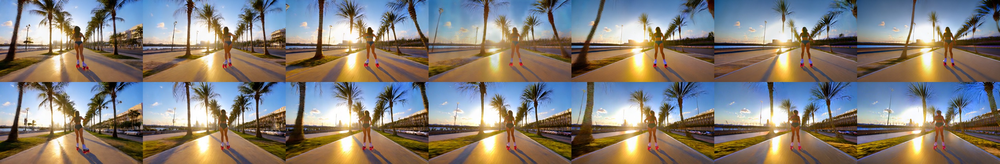

# krea-realtime-bench

Measurements of [Krea Realtime 14B](https://github.com/krea-ai/realtime-video), the open autoregressive video model distilled from Wan 2.1 with Self-Forcing. Vendor numbers are self-reported. These are one lab, one rented H100, one afternoon, and the exact script that produced every number, so the sample size problem has a fix and the fix is you running it.

Method note. The bench does not fork upstream. It instruments the stock code path at runtime (wraps the forward, wraps the cache rebuild, swaps `from_pretrained` for a config-only load that skips a 57 GB download). What gets measured is what they ship.

The model generates video the way an LLM decodes text. Blocks of 3 latent frames, 4 denoising steps per block, and a literal LLM-style KV cache per transformer layer. Post-RoPE keys, contiguous append, sink tokens, rolling eviction. That makes every KV-cache technique from the LLM world applicable to real-time video, and this repo is the measurement floor for that work.

## Numbers (H100 SXM 80GB, 2026-07-24)

Stack. torch 2.8.0, eager (no compile), SageAttention 2.2.1, bf16, 832x480, 9 blocks per run, fixed prompt. Full raw data in `results/`.

| config | fps steady | prefill/block | denoise/forward | peak VRAM |
|---|---|---|---|---|
| kv window 3, 4 steps (the claimed config) | **5.71** | 342 ms | 366 ms | 49.6 GB |
| kv window 3, 5 steps (repo default) | 3.79 | 342 ms | 376 ms | 61.0 GB |
| kv window 6, 4 steps | 3.81 | 714 ms | 398 ms | 55.0 GB |
| kv window 12, 4 steps | 2.55 | 1590 ms | 449 ms | 66.4 GB |
| kv window 21 (global), 4 steps | **OOM** | — | — | >79 GB |

Reading the table. Krea claims 11 fps on a B200 with 4 steps and compile. At roughly 2x the hardware plus compile, that claim is plausible. Multi-seed variance on our runs stays under 1%.

The stability mechanism is the expensive part. The server zeroes and rebuilds the whole KV cache every block with one extra forward over the clean context window. That cost grows linearly with the window and is paid every block, so total cost is quadratic in video length. bf16 KV costs 1.28 GB per latent frame across the 40 layers, and the 21-frame window the offline path uses does not fit in 80GB with the rest of the stack resident.

Two more findings worth your VRAM.

- The official server calls `fuse_projections()` and keeps the unfused q/k/v Linears alive. 17.4B parameters on the GPU for a 14.1B model. That is 6.6 GB doing nothing.
- fp8 weights via the repo's own torchao path halve weight memory (34.9 to 17.4 GB) and cost about 6% fps in eager. Trajectories for both are saved as fidelity references.

## Reproduce it

Requirements. One CUDA GPU with 48GB+ for the small windows (80GB+ for window 12, more than 80GB for window 21), ~60GB disk, python via uv.

```bash
git clone https://github.com/krea-ai/realtime-video
cd realtime-video

# 1. their uv.lock breaks on the clip package with setuptools>=81 build isolation. Fix first:
#    add under [tool.uv.extra-build-dependencies] in pyproject.toml:  clip = ["setuptools<81"]
uv sync
uv pip install libs/sageattention-2.2.1-cp311-cp311-linux_x86_64.whl   # x86_64 only

# 2. models. Note that huggingface-cli is dead in current hub, use `hf`.
hf download Wan-AI/Wan2.1-T2V-1.3B --include "Wan2.1_VAE.pth" --local-dir wan_models/Wan2.1-T2V-1.3B
hf download Wan-AI/Wan2.1-T2V-1.3B --include "google/*" --local-dir wan_models/Wan2.1-T2V-1.3B
hf download Wan-AI/Wan2.1-T2V-1.3B --include "config.json" --local-dir wan_models/Wan2.1-T2V-1.3B
hf download Wan-AI/Wan2.1-T2V-14B --include "config.json" --local-dir wan_models/Wan2.1-T2V-14B
hf download krea/krea-realtime-video krea-realtime-video-14b.safetensors --local-dir checkpoints

# 3. the T5 encoder their code loads exists in no public repo (official Wan ships a .pth,
#    Krea's HF ships no T5 at all). Download the .pth and convert:
curl -L -C - -o wan_models/Wan2.1-T2V-1.3B/models_t5_umt5-xxl-enc-bf16.pth \
  https://huggingface.co/Wan-AI/Wan2.1-T2V-1.3B/resolve/main/models_t5_umt5-xxl-enc-bf16.pth
cp ../krea-realtime-bench/convert_t5.py . && uv run python convert_t5.py

# 4. run
echo "MODEL_FOLDER=wan_models" > .env
cp ../krea-realtime-bench/bench_m0b.py .
uv run python bench_m0b.py          # full sweep, ~10 min of GPU after load
cp ../krea-realtime-bench/bench_fp8.py .
uv run python bench_fp8.py          # fp8 pass, fresh process (a reload in-process OOMs)
```

The bench needs no Wan-14B weights. It instantiates the model from `config.json` and loads the Krea checkpoint on top, which saves you a 57 GB download.

### DGX Spark / GB10 owners, this is for you

A Spark's 128GB unified memory should run the full 21-frame global window that OOMs on an 80GB H100. Nobody has that number yet. Caveats we already know. The uv.lock and the sage wheel are x86_64, so on ARM use NVIDIA's pytorch container, install the deps by hand, and let attention fall back to SDPA. Memory numbers and the recompute curve stay comparable, absolute fps does not, and the receipt is valuable either way.

## The full window curve (H200 141GB, same day)

The H100 hit its wall at the 21-frame window, so we rented the bigger box and finished the curve. Steady-state prefill per block (median of settled blocks, first-touch compile excluded), `bench_kv21.py`, raw data in `results/h200-sxm-2026-07-24/`.

| window (latent frames) | prefill/block | KV cache bf16 | peak alloc | fps steady |
|---|---|---|---|---|
| 3 | 338 ms | 7.7 GB | 49.6 GB | 4.40 |
| 12 | 1592 ms | 19.2 GB | 62.6 GB | 2.38 |
| 15 | 2046 ms | 23.0 GB | 77.9 GB | 2.76 |
| 18 | 2567 ms | 26.8 GB | 85.5 GB | 2.52 |
| 21 | ~2840 ms | 30.7 GB | **93.2 GB** | 2.37 |
| 24 | refused | 34.5 GB allocated | — | — |

- Cross-node sanity holds. Prefill at window 3 and 12 reproduces the H100 numbers within 1% (338 vs 342 ms, 1592 vs 1590 ms). Denoise per forward ran ~14% slower on this H200 node, so treat absolute fps across nodes with care, the curve shape is the finding.
- Linearity confirmed across the whole range, roughly 130 to 143 ms of prefill per context frame, paid every block.
- The 21-frame window peaks at **93.2 GB**. That is why an 80GB H100 OOMs, and the real bar for the full window in bf16.
- **Window 24 is refused by the shipped code.** `WanDiffusionWrapper` hardcodes `seq_len = 32760` (exactly 21 frames at 832x480) and an assert fires in the prefill forward. The "global" window is not just expensive, it is the architectural ceiling of the release. Raising it is a one-line patch, the memory bill afterwards is not.

## The pipeline proxy on a consumer GPU (RTX 4090, same day)

Making the 14B fit a 24GB card takes W4A4 quantization, and the last port of this kind burned about $70 of pod time debugging the pipeline at cloud prices. So the quantization stage gets built and proven on Self-Forcing 1.3B first. Same architecture, same causal loop, same server code, on a local 4090 where every iteration is free. Scripts `bench_1p3b.py` and `make_embedding.py`, raw data in `results/rtx4090-2026-07-24/`.

| config | fps steady | prefill/block | peak VRAM |
|---|---|---|---|
| kv window 3, 4 steps | **7.5** | 161 ms | 11.6 GB |
| kv window 6, 4 steps | 5.4 | 375 ms | 12.6 GB |
| kv window 12, 4 steps | 3.8 | 886 ms | 14.3 GB |
| kv window 21 (global), 4 steps | 2.88 | 2366 ms | **23.6 GB** |

- SDPA eager, bf16, 832x480, 9 blocks, multi-seed variance under 1% on repeat seeds (7.50 and 7.49). Latent trajectories for 3 seeds are saved as fidelity references for the quantized runs to come.
- The recompute curve reproduces the 14B shape. The 1.3B is a faithful laboratory for the full model.
- The global window that OOMs an 80GB H100 at 14B scale fits a 24GB card at 1.3B, barely. Its prefill carries a ~6GB allocation transient and needs `PYTORCH_CUDA_ALLOC_CONF=expandable_segments:True` to survive on 24GB.
- Two release walls nobody documented. The stock T5 loader builds UMT5-XXL in fp32 directly on the GPU, 22.7 GB before any video model loads, so the release cannot even initialize on a 24GB card. `make_embedding.py` computes the prompt embedding on CPU and the T5 never touches VRAM. And the SageAttention wheel shipped in the repo has no sm89 kernels, it imports clean on a 4090 and explodes at runtime, so consumer Ada needs a source build or falls back to SDPA.

### The 6.6 GB fix, measured

The unfused q/k/v finding from the H100 run is now `fuse-dedup.patch`, three lines that drop the original projections after fusion. On the 1.3B it frees 0.44 GB and 212M duplicate parameters, latents stay bit identical under `torch.equal`, fps stays put. Scaled to the 14B geometry that is the 6.6 GB from the finding above. `bench_l1.py` reproduces the measurement. The bench itself keeps instrumenting stock code, the patch is a proposed fix headed upstream.

### A calibration collector that survives the causal loop

W4A4 calibration wants activation statistics from the loop as it really runs. Stock PTQ collectors cache the whole transformer input per step and replay the model later, and a causal server carries gigabytes of mutable KV state inside those very inputs, so replay is not an option here. `collect_wan.py` inverts the flow. Hooks capture the input of every quantization target during real generation, denoise steps and cache recompute both, tagged per call with phase and timestep. One 48 second pass on the 4090 covers the full schedule, 27 calls at each of the 4 denoising timesteps plus 24 recompute passes at t=0, and writes exact channelwise stats plus stratified token reservoirs for every target in every block. The stats already draw the quantization map. Attention and FFN inputs smooth well, the FFN down projection carries post-GELU spikes up to 835x the channel mean, and the cross attention outputs are small enough to just stay bf16. Reports in `results/rtx4090-2026-07-24/` (`collect_summary.json`, `timestep_histogram.json`, `outlier_report.json`), the 2.6 GB of raw token reservoirs travel on request.

### The first W4A4 checkpoint, calibrated from the loop

The collector's reservoirs fed an SVDQuant INT4 pass over all 30 blocks, with DeepCompressor used as a library and its conventions honored end to end. Smooth folded into the weights, a rank 32 low-rank branch, symmetric int4 in groups of 64, and the final rounding done by the stock nunchaku packer, which accepted all 1260 tensors on the first try. The whole calibration took 163 seconds on the 4090. `ptq_wan.py` runs it, `convert_wan.py` emits the two-file nunchaku checkpoint. 0.74 GB of quantized blocks plus 0.28 GB kept in bf16, against 2.6 GB for the same blocks unquantized.

Per-module simulated W4A4 output error against the real-loop reservoirs tells an inverted story. The cross attention output projection, the stream with the wildest outlier channels, came out cleanest at 5.2% median, so it went into the artifact after all. The FFN down projection is the honest worst at 15.7% median, and an ablation on its worst block splits the blame. With fp activations the error drops to 9.4%, with fp weights it only drops to 14.7%, so the activation side dominates, the rank 32 branch buys just 1.4 points there, and the named next lever is the unsigned activation shift the upstream recipe already supports, not a bigger rank and not GPTQ. Raw numbers in `results/rtx4090-2026-07-24/` (`ptq_report.json`, `ablate_ffn2.json`).

### The W4A4 runtime, running

The port is deliberately small. Only the calibrated Linears become `SVDQW4A4Linear`, and the attention math, RoPE, norms, KV cache and server loop stay stock (`nunchaku_causal_wan.py`, loaded from the two-file checkpoint with the key renames the other nunchaku ports use). Before touching the loop, a unit test replays the captured mid-generation fixtures through the real sm89 kernel and compares against the bf16 reference. The kernel lands within a point of the calibration simulation on every slot (`test_w4a4_fixtures.py`), so the whole chain from collector to kernel is numerically coherent.

Then the loop itself, `bench_w4a4.py`, raw data in `results/rtx4090-2026-07-24/results_w4a4.json`.

| config | fps steady | peak VRAM | bf16 reference |
|---|---|---|---|
| kv window 3, 4 steps | **8.8** | 9.4 GB | 7.5 fps, 11.1 GB |
| kv window 21 (global), 4 steps | **4.8** | 21.4 GB | 2.88 fps, 23.6 GB |

- 17% faster on the small window, 67% faster on the global one. The recompute pass is GEMM-heavy, which is exactly what W4A4 accelerates, while the small-window frame is dominated by SDPA. Transformer weights after load are 1.07 GB against 2.84 GB in bf16.
- Latents stay finite across 3 seeds and both windows, and the frames are coherent video (the dancer, the warehouse, the light). Last frames for both windows in `frames/`.
- The W4A4 trajectory diverges from the bf16 one, as 27 autoregressive latent frames of few-percent per-module error must. Divergence is not a quality verdict. The fidelity ruler below is.

### The fidelity ruler, and why trajectory closeness is the wrong ask

Before judging the W4A4 by its distance to the bf16 trajectory, we measured what that distance means. A 0.1% perturbation injected once into a single bf16 forward gets erased by the arithmetic itself, because bf16 resolves about 0.4% per element. A 1% perturbation injected once grows 48.7x over 27 autoregressive frames and heads toward the distance between two different seeds (`ruler_l5_chaos.py`, `chaos_floor.json`). The sampler is chaotic, so no sustained per-step error, including bf16's own rounding, can hold a trajectory close. Any ruler that demands it fails everything.

So the ruler asks what can actually be held. Per-frame divergence against the bf16 reference stays below the distance between two valid videos for the whole clip (0.60x that control early, 0.88x late, 3 seeds). Cross-seed diversity inside the W4A4 model matches the bf16 model at a 0.89 ratio, so the model did not collapse. Latent statistics track bf16 within 10%. A double-length run of 18 chunks holds a settled std slope of 0.0071 per frame against bf16's own 0.0080, meaning the rise is the video gaining motion, not the quantization drifting. And the frame strips stay coherent to the last frame of the double-length run (`frames/strip_bf16_vs_w4a4.png`, rows bf16, W4A4, W4A4 at 18 chunks). All raw numbers in `ruler.json`, scripts `ruler_l5_runs.py` and `ruler_l5_metrics.py`.

Verdict. The W4A4 makes a different video of the same prompt with the same stability, the same diversity and the same statistics as bf16, at 8.8 fps where bf16 gives 7.5. On this model the pipeline holds. The 14B is next, and it needs one A100 pass, not faith.

## The A100 pass, and the proxy paying off (same day)

One rented A100 80GB ran the proven chain against the 14B. Collect on the real loop took 8 minutes, calibration of all 40 blocks took 22.5 minutes, and the stock packer accepted every tensor again. The whole pass cost about $3.60 including a dead community host that billed 35 minutes without ever booting its container. Scripts in `cloud/setup_c.sh` and `cloud/driver_c.sh`, raw numbers in `results/a100-2026-07-24/`.

The receipt that matters is the transfer. Per-stream simulated W4A4 output error, median across blocks, small model against big model.

| stream | 1.3B | 14B |
|---|---|---|
| self qkv | 0.081 | 0.081 |
| self out | 0.122 | 0.128 |
| cross q | 0.120 | 0.079 |
| cross out | 0.052 | 0.048 |
| ffn up | 0.093 | 0.091 |
| ffn down | 0.157 | 0.158 |

The 1.3B predicted the 14B's calibration behavior stream by stream, with the qkv median matching to three decimals. The post-GELU outliers run twice as wild at 14B scale, one channel at 1644x its mean against 835x on the small model, and the smoothing plus the low-rank branch absorb them to the same final error. Debugging on the small model and spending cloud money only on the scaled pass is the whole method, and this table is what it bought.

The converted checkpoint weighs 6.6 GB of quantized blocks plus 4.2 GB kept in bf16, against roughly 25 GB for the same blocks unquantized. Whether it generates on a 24 GB consumer card is the next receipt, and it runs on hardware we own.

## Krea Realtime 14B generates video on one RTX 4090

The first attempt missed by 442 MB. The loader never materializes the bf16 model anywhere, it builds the transformer skeleton on the meta device, assigns in the non-quantized tensors, recomputes the RoPE table and swaps the quantized slots straight onto the GPU (`bench_v.py`), and the whole model loads in 4.5 seconds at 11.25 GB. The generation then ran out of memory inside the VAE decode, because the cross-attention k and v projections, kept in bf16 by the calibration skip list, are 99.9 percent of that bf16 remainder at 14B scale. So they got quantized too, on the 4090 itself, in 130 seconds, from the calibration reservoirs the A100 pass had left on the Hub (`ptq_cross_kv.py`, median error 7.5 percent, the branch absorbing outlier channels that run at 80x their mean). Recalibration without renting anything, on the first day the workflow existed.

With the blocks at 7.76 GB the model generates.

| measure | value |
|---|---|
| fps steady, kv window 3, 4 steps, 832x480 | **2.81** (four runs, 2.78 to 2.81) |
| peak VRAM | **22.78 GB** |
| latents | finite, 3 seeds, three clearly distinct videos |
| kv window 6 | does not fit, the window-3 cache is the card's envelope |

Half the fps of the bf16 model on an H100, from a card that cannot even initialize the bf16 model. Frames and raw numbers in `results/rtx4090-2026-07-24/w4a4-14b/`. The remaining distance to real time runs through kernel fusion, the 4-bit KV cache, and spending the four-bit budget where the model needs it, and every one of those steps now iterates on a consumer card at zero marginal cost.

## Quantizing the weights did not remove the bottleneck, it moved it

The obvious next lever looked like `torch.compile`, because it costs nothing and needs no CUDA toolkit. It is not the lever, and finding out took one bench. The frame splits into transformer 83 percent (denoise plus the KV cache recompute at 14.8 percent) and VAE decode 15.7 percent, measured with a sync around each piece against a control that reproduced the gate exactly at 2.81 fps and 22.777 GB (`bench_fps.py`, `results/rtx4090-2026-07-24/fps-probe/attribution-and-compile.json`). The 83 percent cannot be compiled at all, because the Nunchaku W4A4 linears enter through a pybind extension rather than the torch dispatcher, so dynamo graph-breaks at every one of the 400 quantized slots. And every compiled run died with a 586 MB out-of-memory, not from difficulty but from having nowhere to grow. Asked where memory is free, with only the decoder on the card replaying the real latents from the gate run, the compiled VAE gives 1.31x for 6.32 GB of extra peak (`bench_vae.py`, `vae-isolated.json`). On a 15.7 percent slice that is 3.7 percent end to end, for memory the card does not have.

So we counted the bytes instead of projecting them (`bench_mem.py`, `memory-profile.json`).

| on the card, kv window 3 | GB |
|---|---|
| W4A4 weights | 8.23 |
| **KV cache**, `[1, 9360, 40, 128]` bf16, 40 layers, k and v | **7.67** |
| cross-attention cache | 0.42 |
| VAE, pipeline, activations, latents | about 6.45 |
| **peak / free** | **22.77 / 0.92** |

The model was quantized to four bits and the cache is now almost the size of the model. The window-6 and window-12 caches do not fail on architecture, they fail inside `_initialize_kv_cache` by 138 MB and 230 MB. What binds this card is the cache, and four-bit KV would free 5.63 GB, six times the headroom that exists.

## The recompute is a rule, not a cost, so we made its period a control

Krea holds long context stable by rebuilding the whole KV cache every block. It zeroes the cache, assembles a clean context of the anchor frame plus the most recent denoised latents, and refills with one forward at timestep zero. The cache therefore never holds keys and values derived from noisy intermediate states, which is why error cannot accumulate in it. That is a generative rule, closer to calling `background()` inside `draw()` than to an optimization, and replacing it with a resident cache is a change of medium presented as a change of cost. So before spending the four-bit budget to erase the rule, we made the period a parameter and swept it (`bench_n.py`).

Three findings in the released code came out of building that sweep, and they are a gift back. `init_models` sets `block.self_attn.local_attn_size = -1` twice on the way in, while only the pipeline receives the real window, so the rolling eviction with attention sinks can never fire and `max_attention_size` stays at 32760. `sink_size` is 0 everywhere, so in a resident regime the eviction would discard the anchor frame. And `do_kv_recomp` sits in both server configs and in `test_request.py` while `release_server.py` never reads it. The resident path is written and unreachable.

Four regimes, same memory, same seeds, 18 blocks, judged blind before the key was opened.

| reset period | fps, dancer, 3 seeds | fps, skater, 3 seeds | recomputes |
|---|---|---|---|
| every block (upstream) | 2.23 | 2.27 | 18 |
| every 2 blocks | 2.38 | 2.45 | 9 |
| every 4 blocks | 2.45 | 2.52 | 5 |
| never | 2.52 | 2.59 | 1 |

Latents stayed finite in all twelve runs of both prompts, and the resident regime showed no numerical divergence at all. Its latent maxima came in lower than the upstream regime, not higher. On a doubled run of 36 blocks, about 26 seconds of video, the four regimes remain 13 percent apart in fps and the verdict by eye was that quality is very close in all of them and what changes is the path the animation takes. Raw numbers, the blind key and both prompts in `results/rtx4090-2026-07-24/reset-period/`.

One negative result worth publishing. We tried to settle the ordering with a CLIP retention curve, frame t against frame 0, and it does not measure what it looks like it measures. On the moving-camera prompt retention rose monotonically as resets got rarer, which would rank upstream last, and the reason is that the metric was tracking how much the camera moved rather than how much identity drifted. On the static-camera prompt it registered the drift correctly, around 20 to 23 percent loss by the last third, but the spread between seeds was larger than the spread between regimes, so it separates nothing at n=3. A whole-frame embedding is the wrong probe here. The next ruler crops the subject (`ruler_identity.py`, `ruler-dance.json`, `ruler-skate.json`).

## The cache goes to four bits, and the twelve frame window opens

The cache is a list of 40 dicts holding `[1, S, 40, 128]` bf16 keys and values, and the runtime touches them in exactly three operations, a slice write, a rolling eviction and a slice read, plus `.shape` and `.zero_()`. So `quant_kv.py` swaps in an object that behaves like a tensor across those three and nothing upstream gets forked. Storage is int4 packed two values per byte with one scale per token, per head, per rotary band. Reads dequantize the requested window, and the transient is per layer, about 192 MB of live bf16 at a time against 7.67 GB resident.

Two design choices came out of measurement on real post-rotary keys pulled from a live generation (`test_quant_kv.py`, `results/rtx4090-2026-07-25/fixtures.json`). Rotary embedding pairs adjacent channels, verified in `causal_rope_apply`, so a contiguous group never splits a pair. But the frequencies split into three bands, real channels `[0:44)` temporal and `[44:86)`, `[86:128)` spatial, and a blind group of 64 straddles that boundary.

| scheme | key error | value error | bytes vs bf16 | temporal band, layer 39 |
|---|---|---|---|---|
| int4, blind groups of 64 | 0.130 | 0.114 | 0.266 | **0.176** |
| int4, rotary bands | 0.119 | 0.107 | 0.273 | 0.127 |
| int4, blind groups of 32 | 0.110 | 0.101 | 0.281 | 0.138 |
| int4, bands subdivided by 4 | **0.080** | 0.080 | 0.344 | **0.084** |
| int8, rotary bands | 0.0076 | 0.0063 | 0.523 | 0.0076 |

The blind grouping costs 40 percent more error in the temporal band alone, and error that tracks frame position is the worst kind to have in video. Subdividing inside the bands and never across them halves the key error for 7 percent more bytes. Keys quantize 11 percent harder than values, which is what a key being an address and a value being content predicts.

The reference implementation loops over bands in Python and cost 20 to 31 percent of the frame in format conversion, so it got two fused Triton kernels, one program per token and head (`quant_kv_kernels.py`, `test_kernels.py`). Dequantization is bit identical to the reference and 10 to 13 times faster, quantization differs only on rounding ties. The number that decided the design is that dequantization went flat in group count, 0.188 against 0.174 against 0.176 milliseconds for three, six and twelve groups, so the finest grouping became free on the path that dominates. Conversion fell to between 1.3 and 2.6 percent of the frame.

| configuration | cache | peak | free | fps |
|---|---|---|---|---|
| bf16, 3 frame window (the M1 gate) | 7.67 | 22.78 | 1.02 | 2.78 |
| int4, 3 frame window | **2.10** | 17.21 | 6.37 | 2.30 |
| int4 with fused kernels, 3 frames, no rebuild | 2.10 | 19.02 | — | **2.96** |
| **bf16, 6 frame window** | 11.50 | — | — | **out of memory** |
| int4, 6 frame window, rebuild every 4th block | 3.15 | 20.40 | — | 2.52 |
| int4, 12 frame window, rebuild every 4th block | 5.24 | 23.16 | — | **1.99** |

Quantizing the cache frees 5.571 GB. The 6 and 12 frame windows run for the first time, and in bf16 the 12 frame cache alone would need 19.2 GB.

One measurement caveat that cost a 2x error before it was caught. Any run that follows an out of memory failure in the same process is not trustworthy, because allocator state after OOM degrades and `empty_cache` does not undo it. The 6 frame window measured 0.84 fps that way and 1.74 in a clean process (`diag_kv6.json`).

## Transient grey, found by eye, and the mechanism

Watching the long window clips turned up something no metric here had caught. Short moments where everything goes slightly grey and recovers, two in the 12 frame clip and one in the 6 frame clip. Finite latents, stable magnitudes and an identity retention curve all reported the clips were fine, and that retention curve turned out to be tracking camera motion rather than identity, which is filed below as a negative result.

Measuring frame contrast located the events exactly where they were reported (`find_grey.py`). The description offered alongside the observation turned out to be the mechanism. Mixing modelling clay of every colour gives grey, because an average of many different things tends toward the middle. Attention does this literally. When the distribution spreads instead of selecting, the output is a mean over many values, and a mean of diverse states has low variance.

Probing the attention distribution per block confirms it (`probe_attention.py`, 32 query positions, layers 0, 13, 27, 39).

| 6 frame window, blocks 2 onward | resident cache | rebuild every block |
|---|---|---|
| corr(max attention weight, contrast) | **+0.794** | +0.33 |
| corr(entropy, contrast) | **−0.769** | +0.84 |
| range of max attention weight | 0.0171 | **0.0033** |
| range of entropy | 0.0255 | **0.0065** |
| grey blocks | 12 and 15 | none |

In the rebuild regime both signals sit flat within a fifth of the range and no grey appears, so its correlations are noise on a flat signal. Krea's cache rebuild works because it derives every key from one clean context at timestep zero, which leaves the keys homogeneous and comparable.

Controls, four runs each on the 6 frame window. Quantization is not the cause, an int8 cache with 15 times less error keeps the event. Requantizing survivors during eviction is not the cause either, a lossless packed move fixed that and the grey stayed. Dropping the bf16 anchor is as damaging as quadrupling the window, 40 affected frames against 7 to 22.

## A sensor that fires on spread does not work, and why

The obvious instrument is a reset that fires when the mixture starts turning grey instead of every fixed number of blocks. It fails (`adaptive_reset.py`). The sensor costs about 2 percent of the frame and predicts the collapse, but the gate fires once in eighteen blocks and lands where the resident regime already was, 30, 2 and 3 affected frames against 15, 7 and 11.

The reason is worth more than the feature. Homogeneity behaves as a continuous property that survives by never being allowed to break, rather than a state that gets repaired afterward. By the time a sensor reports, the damage already sits in the cache, and one cleanup buys a single block before the accumulation resumes.

## The reset period as a measured curve

Twelve frame window, four seeds, 210 frames each.

| rebuild period | fps | degraded frames per seed | worst contrast drop | rebuilds |
|---|---|---|---|---|
| every block (released behaviour) | 1.45 | 0, 0, 0, 0 | 6.9% | 18 |
| every 2 blocks | 1.79 | 2, 0, 0, 0 | 10.7% | 9 |
| **every 4 blocks** | **1.99** | **0, 0, 0, 0** | 8.7% | 5 |
| never | 2.29 | **32, 35, 30, 28** | **37.6%** | 1 |

Never rebuilding degrades 28 to 35 frames out of 210 in every single seed. Any finite period gives zero. Rebuilding every fourth block runs 37 percent faster than the released behaviour with nothing given up that this ruler can see.

The last comparison inverted the expectation. Under a finite rebuild period the 12 frame window is more stable than the 6 frame window, zero degraded frames against seven, worst drop 8.7 percent against 11.5, because the clean context rebuilt each time carries eleven frames of history instead of five and attention has more homogeneous material to select from. The long window buys stability, and it reads as a cost only when the rebuild is removed.



*Twelve frames of context on one RTX 4090, four bit weights and a four bit cache, 832x480, 4 steps, seed 42, columns aligned by frame index. Top row never rebuilds the cache, bottom row rebuilds every fourth block at 1.99 fps.*

## A negative result on measuring identity drift

Before the contrast measurement, the plan was to settle the reset question with a CLIP retention curve, frame t against frame 0, and it does not measure what it looks like it measures. On the moving camera prompt retention rose monotonically as rebuilds got rarer, which would rank the released behaviour last, and the reason is that a whole frame embedding tracks how much the camera moved. On the static camera prompt it registered drift correctly, 20 to 23 percent loss by the last third, but the spread between seeds exceeded the spread between regimes so it separates nothing at three seeds. Crop the subject instead (`ruler_identity.py`, `ruler-dance.json`, `ruler-skate.json`).

## Chasing frames per second, and the ceiling an eye put on it

Four levers were left after the cache work. Three of them are measured here, one was closed.

The attention kernel first. The wheel the release ships (`libs/sageattention-2.2.1-...whl`) **carries no sm89 kernels**, so on a 4090 the call dies on an assert and every number in this repo before this section was measured with `DISABLE_SAGEATTENTION=1`. Building SageAttention from source with `TORCH_CUDA_ARCH_LIST=8.9` fixes it. The toolkit has to match torch rather than the driver, which means CUDA 12.8 for a cu128 build even though the driver accepts 13.2, and the package has to be `cuda-toolkit-12-8` so no driver is touched. Measured over 30 blocks, the denoise forward goes from 0.798 to 0.716 seconds, which is 1.11x on that stage and 6.0 percent on the frame.

Compiling the VAE decoder is not worth it. In the loop it gives 1.12x on the decode and 4.5 percent end to end, for 4.4 GB of extra peak. That memory is worth more as context than as speed.

The decoder itself is the interesting one. `load_vae()` hardcodes the heavy decoder and **never reads the `use_taehv` flag** that sits in both server configs, which makes it the fourth dead flag found in this codebase, after the doubled `local_attn_size = -1`, the zero `sink_size` and the unread `do_kv_recomp`. The tiny distilled decoder that ships in `demo_utils/taehv.py` decodes the same three latent frames **25.6 times faster**, 0.0256 seconds against 0.6554, for 11.3 million parameters against the full VAE.

It cannot be dropped in as shipped. `apply_model_with_memblocks` allocates its temporal memory fresh on every call, and a server that decodes one block at a time would start each block with empty memory. Measured against the heavy decoder as a control, that leaves a seam. Frame to frame difference at block boundaries divided by the same difference inside blocks reads 1.023 for the heavy decoder, 3.008 for the tiny one called per block, and **1.208 once the memory is hoisted out of the traversal and carried across calls** (`taehv_stream.py`). Round trip error against the heavy decoder is 0.064 mean absolute in a zero to one range.

## The frame is an equation, and steps are the big term

Sweeping denoise steps at a fixed window gives a clean linear fit.

| steps | fps | block | gain |
|---|---|---|---|
| 4 | 2.88 | 4.05 s | 1.00x |
| 3 | 3.61 | 3.23 s | 1.25x |
| 2 | 4.79 | 2.44 s | 1.66x |
| 1 | 7.12 | 1.64 s | 2.47x |

That is **block = steps x 0.717 s + fixed**, with the fixed part at 0.841 s using the heavy decoder and 0.203 s using the tiny one. The fit predicted 0.920 s for a one-step run and the measurement came back 0.929 s. At one step the fixed part is half the block, so the decoder stops being a detail and becomes the second biggest term.

Stacking one step, SageAttention and the tiny decoder gives **12.73 fps at 832x480 with a peak of 14.06 GB and 0.93 s of block latency**, on a card that cannot load the bf16 model at all.

## And then the gate that matters said no

That 12.73 fps configuration was rejected on sight. Not marginal, not arguable. The subject fell apart.

Isolating the cause took one existing grid that had been sitting unjudged. Across four step counts with the heavy decoder, the verdict was **four steps good, three steps acceptable, below that unusable**. So the step count is the cause and the decoder is exonerated. Which reprices the whole table.

| steps | verdict | block | fps |
|---|---|---|---|
| 4 | good | 3.07 s | 3.8 |
| 3 | acceptable | 2.35 s | **5.0** |
| 2 | unusable | 1.64 s | 7.2 |
| 1 | unusable | 0.92 s | 12.7 |

**The real ceiling of this model on this card, at quality a person will accept, is 5.0 fps.** The 12.73 existed and was fps of unusable video. Every optimisation above is still real, and none of it moves that line, because the line is set by how many denoising steps the content needs rather than by how fast a step runs.

The methodological failure is worth stating plainly. Three things were optimised in sequence with fps measured at every step and quality measured at none. When the eye finally entered, it invalidated the result, and the answer to which piece to revert came from a comparison that had been ready for hours and had never been put in front of anyone.

## What the model does with a prompt it can read

Two findings sit at the boundary between engineering and use, and both cost a full afternoon.

The first is a bug worth publishing because anyone writing their own text encoder path will hit it. The tokenizer pads to 512 positions and the encoder produces values at the padded ones. `make_embedding.py` zeroes everything past the real tokens before saving. A rewritten faster encoder that skips that step produces embeddings where all 512 positions carry signal, the padding dominates conditioning, and **the model outputs flat brown mush with a lattice artifact**. Latents stay finite, no error is raised, throughput is normal. Every instrument reads healthy.

The second is that the model ships its own prompt specification and it is easy to miss. `wan/utils/prompt_extend.py` contains the system prompt Wan uses to rewrite short inputs, and it is the documented format: declare a style first, describe the subject with attributes, describe the background separately, emphasise motion and camera movement with direct verbs, and end with shot scale. The four worked examples run 400 to 600 characters.

Terse keyword prompts of around 120 characters, with no style declaration and no shot scale, produce moving texture rather than composed image. The same model, same seed, same quantised stack, given the documented format, produces a solar sphere with a limb against starfield, or a vertical column of light with rings and lateral sparks. Nothing changed except how the prompt was written.

## Video to video, first measurements

The regime the interactive case actually needs is not text to video. The schedule is `linspace(strength * 1000, 0, steps)`, so at strength 0.7 the first timestep is 700 rather than 1000 and the model starts from a partially noised input frame instead of from nothing. Each step covers less of the noise range.

| strength | steps | fps | block |
|---|---|---|---|
| 0.7 | 4 | 3.25 | 3.54 s |
| 0.7 | 2 | 5.36 | 2.15 s |

Encoding the source costs about 7 seconds once per session in `input_video` mode. In webcam mode that cost becomes continuous and per block, so the latency figure for a live installation is not this one.

One structural note before anyone reads too much into the speed. Krea Realtime is a text to video causal model **with** a video to video path, rather than a model designed for video to video. The difference shows up in output rather than in throughput.

## Limitations, stated before you find them

- One prompt (a dancer in a warehouse), one resolution (832x480, the causal path hardcodes its RoPE for it), one GPU class, one day. The prompt is now a flag (`--prompt` or `BENCH_PROMPT`), so widen it.
- Eager only, no `DO_COMPILE`. The compiled number would be higher and less comparable across boxes. The memory numbers and the recompute curve do not depend on it.
- fps here is end-to-end through VAE decode and frame callback, not transformer-only marketing fps.
- n=1 on hardware. That is the whole point of the receipt format below.
- The reset-period sweep is 3 seeds per regime on two prompts. "Quality is very close in all of them" is one pair of eyes on unlabeled clips, not a measured equivalence, and the ruler we tried could not separate the regimes at that sample size. Read it as no visible penalty found, not as no penalty.
- `torch.compile` is reported as unusable on this build for a specific reason, opaque pybind kernels plus no memory headroom. Both conditions can change. A dispatcher-registered kernel or a smaller resident footprint would reopen it.
- The grey collapse is measured by frame contrast, which is a proxy. It was found by eye first, and the ruler was built afterward to match what the eye had already located. It does not detect identity drift, which an eye catches and which no metric here catches yet.
- The reset period curve is four seeds on one prompt at one window. "Any finite period beats none" is solid across every seed. "Every fourth block is the best finite period" is not, the finite periods sit inside each other's spread.
- W4A4 attention is nondeterministic across runs, so the same seed and the same configuration do not reproduce. Single runs are anecdotes here, which is why everything above is reported per seed.
- The step-count verdict (four good, three acceptable, below unusable) is one person's eye on one prompt family at 832x480. It is the gate this work answers to, and it is not a measurement anyone else can reproduce without their own eye.
- The V2V numbers use a generated clip as input, not camera footage. Camera grain, room lighting and real motion are a different problem, and webcam mode was not measured at all.
- TAEHV weights came from a third party mirror, since the original repository is gone. They are verified by output rather than by provenance.

## Send back a receipt

Open an issue (or bring it to the Waffle House) with

- `results_m0b/results.json` (the script writes it, includes GPU, torch, per-run timings, peak memory)
- the console log (it records which attention backend loaded)
- anything that broke, with the exact error. Friction reports are receipts too.

## Lineage and what comes next

This is the measurement floor for making the 14B run on consumer GPUs. Next steps live downstream. W4A4 weights via SVDQuant (same pipeline as the [nunchaku Krea 2 port, PR #947](https://github.com/nunchaku-ai/nunchaku/pull/947)), then 4-bit KV cache as the cheap alternative to quadratic recompute, then a trajectory-based fidelity benchmark, all open.

Code here is MIT. The Krea Realtime 14B weights are CC-BY-NC-SA, their license travels with them.
